## Documentation for Project 2
## LEMP Stack Implementation  - aws virtual server

## STEP 1 — INSTALLING THE NGINX WEB SERVER

-- Starting by ssh into my server labelled 'LEMP Nginx-Web Server' from my vscode terminal in windows machine 

`sudo apt update`--(running command to update my list of packages in package manager)
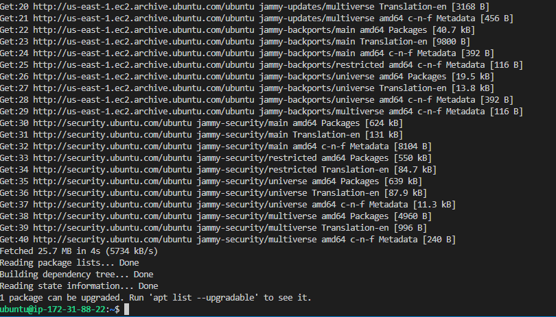 --screenshot shows update completed 

`sudo apt upgrade`--(To upgrade Ubuntu)
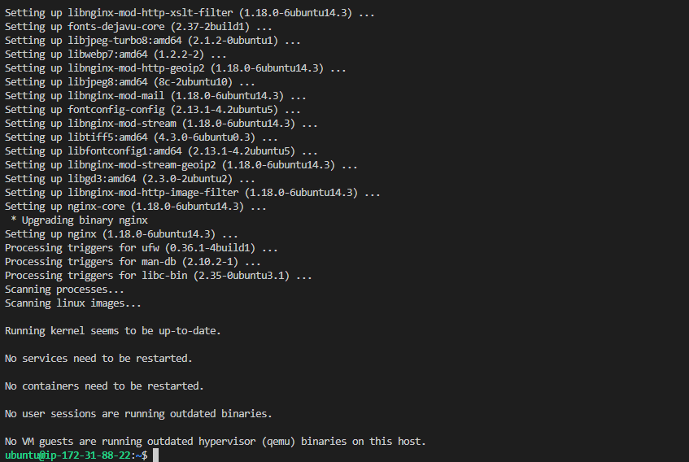

`sudo systemctl status nginx`--(To verify that nginx is running as a Service in our Ubuntu OS)
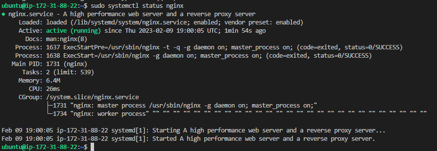

`curl http://localhost:80` --(Using curling command with DNS Name option - to check how we can access Nginx server locally within ubuntu shell. Objective - Use curl command to request our Nginx Server on port 80.
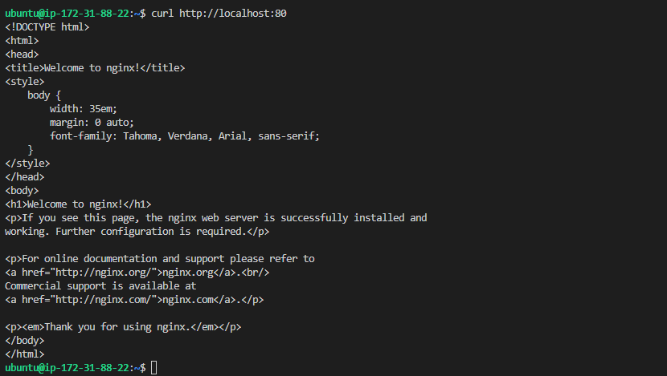

`http://52.207.136.248` --(Opened a new browser and ran command to test if we can view our Nginx server via the internet. Webpage displayed validating Nginx web server is operational, after installation on ubuntu system.
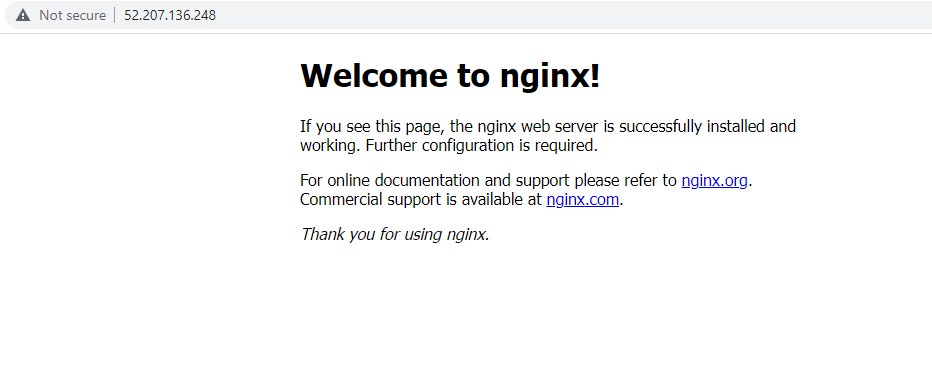

`curl -s http://169.254.169.254/latest/meta-data/public-ipv4` --(Retrieving my Public IP address from my terminal.Testing how to retrieve files content in my metadata directory.
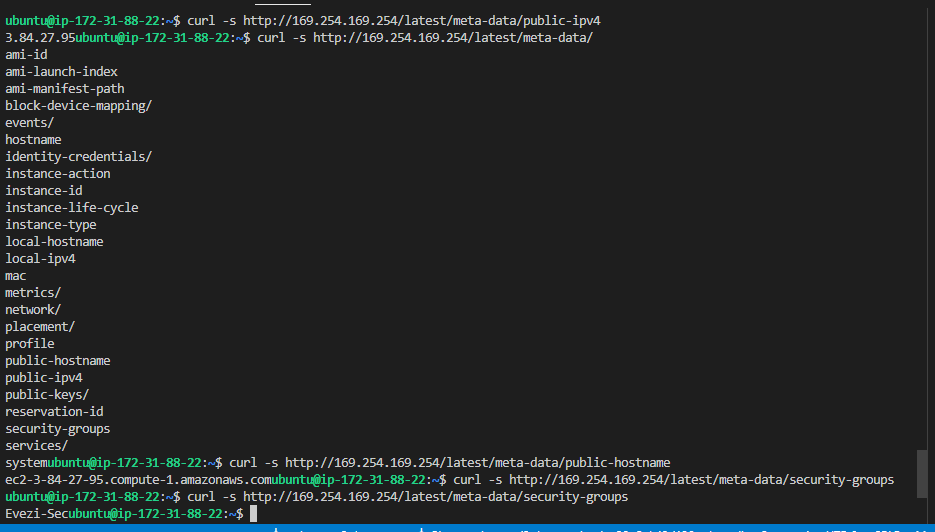

## STEP 2 — INSTALLING MYSQL

`sudo apt install mysql-server`--(Mysql database software installed to my apache server)
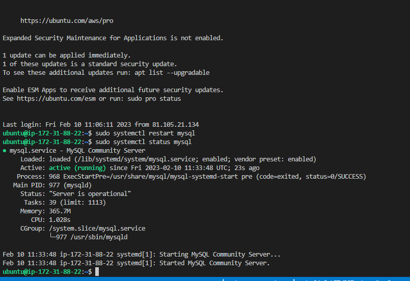

`sudo mysql` --(successful login into the MySQL console, connected as administrative database user root)
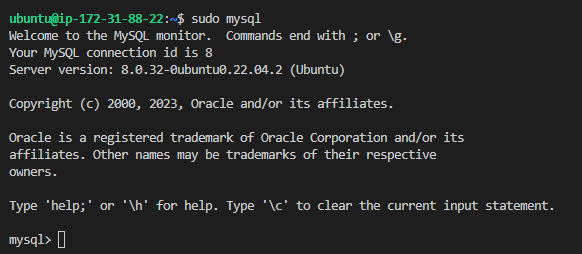

`ALTER USER 'root'@'localhost' IDENTIFIED WITH mysql_native_password BY '<password>';`--(Setting up a default authenticate password for mysql,confirming mysql query for password)
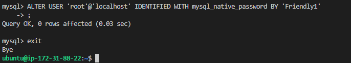

`sudo mysql_secure_installation`--(running interactive security script that comes pre-installed with MySQL to secure my password, password plugin validated).
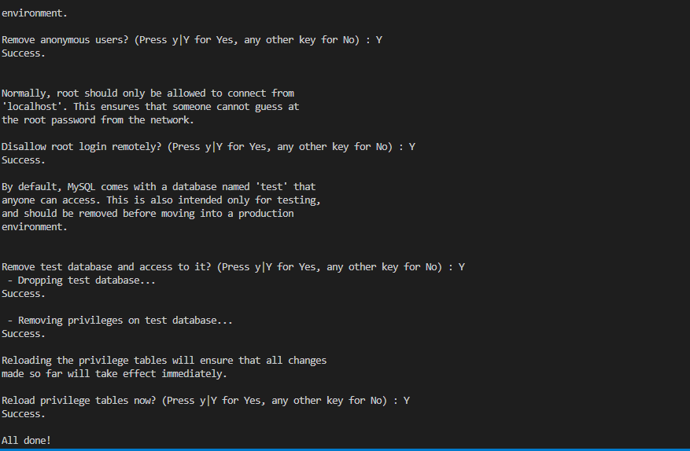

`mysql -u root -p`--(Test:1. successful login back to MySQL console)
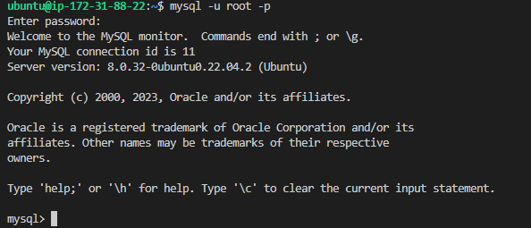

## STEP 3 — INSTALLING PHP

`sudo apt install php-fpm php-mysql`--(Installing all 2 packages to PHP component;1. PHP fastCGI Manager, 2. PHP Module).
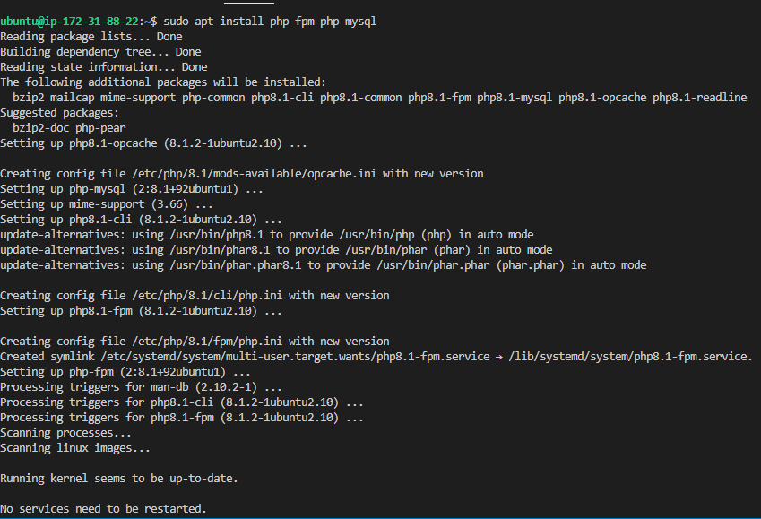

## STEP 4 — CONFIGURING NGINX TO USE PHP PROCESSOR

`sudo mkdir /var/www/evezidomainLEMP`--(Creating a domain for my root web directory in my Nginx web server).
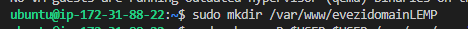

`sudo chown -R $USER:$USER /var/www/evezidomainLEMP`--(Assign ownership of my new directory with the $USER environment variable which will reference your current system user).
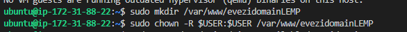

`sudo namo etc/nginx/sites-available/evezidomainLEMP`--(crete and open a new configuration file in Nginx sites-available directory using nano text editor inserted snippet script).
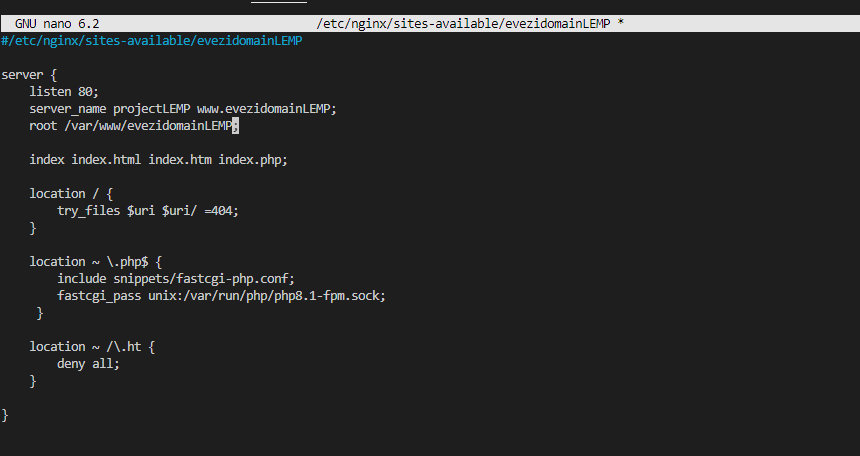

`sudo ln -s /etc/nginx/sites-available/evezidomainLEMP /etc/nginx/sites-enabled/`--(Activate my configuration by linking to the config file from Nginx’s sites-enabled directory informing Nginx to use the configuration next time it is reloaded).
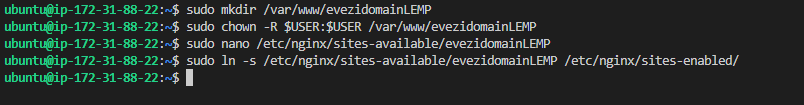

`sudo nginx -t` --(Testing my configuration file syntax is error free and 2. Apache webserver is reloaded and website is now active).
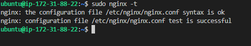

`sudo unlink /etc/nginx/sites-enabled/default` --(Disabling default Nginx host that is currently configured to listen on port 80).
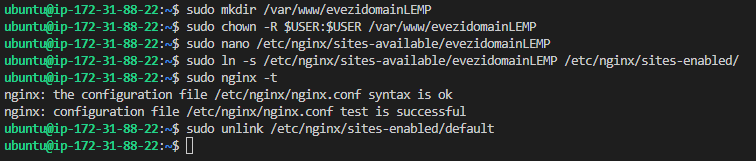

`sudo systemctl reload nginx` --(reloading Nginx to apply changes).
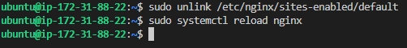

`sudo echo 'Hello LEMP from hostname' $(curl -s http://169.254.169.254/latest/meta-data/public-hostname) 'with public IP' $(curl -s http://169.254.169.254/latest/meta-data/public-ipv4) > /var/www/evezidomainLEMP/index.html`--(Creating an index.html file in my web root enable test of new server block works as expected - Using Public IP address)
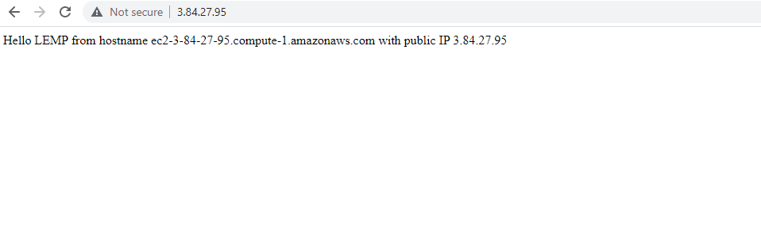

--(Using DNS Name to launch website - achieving same result Echoing Public DNS name and Public IP address)
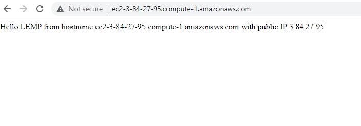

## STEP 5 — Testing PHP with Nginx

 `sudo nano /var/www/evezidomainLEMP/info.php`--(creating a new test PHP file called (info.php) in my document root).
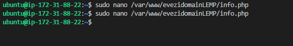

`<?php info.php();`--(Edited new file in my document root with valid PHP code in the nano line text editor).
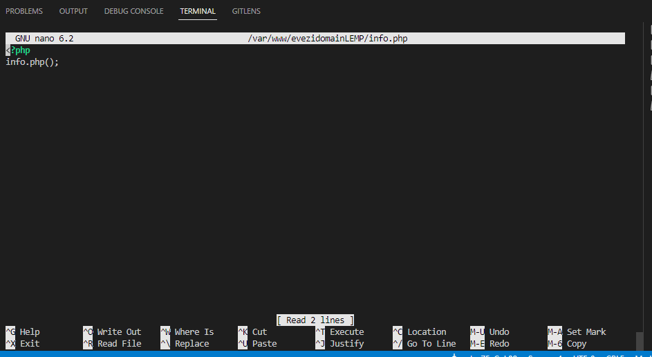

`<?php info.php();`--(Access my webpage through web browser by using public IP address I set up in your Nginx configuration file, validating that Nginx can correctly hand .php files off to my PHP processor.)
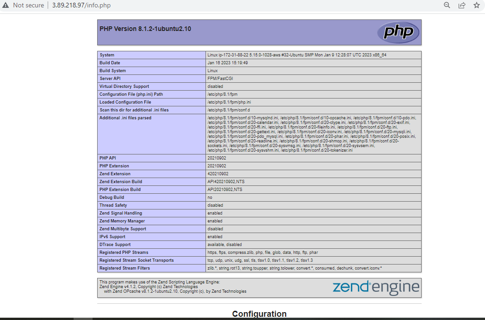

`sudo rm /var/www/evezidomainLEMP/info.php`--(Removed PHP test file created from PHP server as it contains sensitive information of my PHP environment and my Ubuntu server).
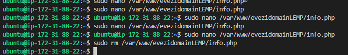

## STEP 6 — RETRIEVING DATA FROM MYSQL DATABASE WITH PHP (CONTINUED)
`mysql -u root -p` --(successful login into the MySQL console, connected as administrative database user root)
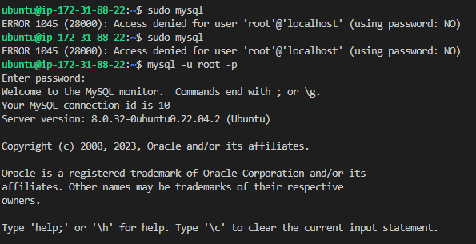

`CREATE DATABASE `rain_database`;` --(successfully creating a new database in MySQL console)
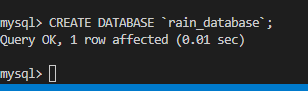

`CREATE USER 'rain_user'@'%' IDENTIFIED WITH mysql_native_password BY 'Friendly1';` --(successfully creating a new user for the newly created database and grant user full privileges on the database just created)
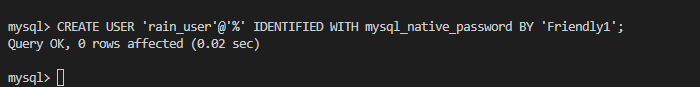

`GRANT ALL ON rain_database.* TO 'rain_user'@'%'` --(Give this user permission over this rain_database)
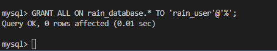

`mysql -u rain_user -p` --(Relogging into mySQL to test assigned permissions works and confirm that user has access  - "rain_database")
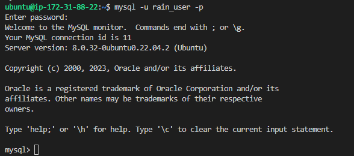

`SHOW DATABASES;` --(Showing rain_database in tabular formate "3 rows")
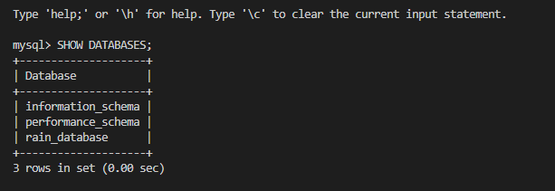

`CREATE TABLE rain_database.todo_list (item_id INT AUTO_INCREMENT, content VARCHAR(255), PRIMARY KEY(item_id));` --(creating a test table named todo_list from the MySQL console)
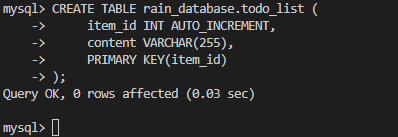

`INSERT INTO rain_database.todo_list (content) VALUES ("My first important item");` --(Insert a few rows of content in the test table. Also repeated command lines a few times, using different VALUES)
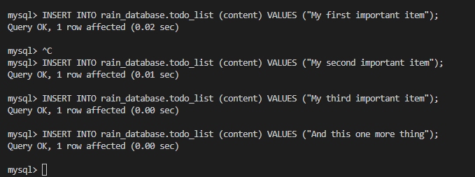; 

`SELECT * FROM rain_database.todo_list;` --(To confirm that the data was successfully saved to my test table)
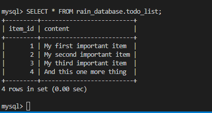;

`nano /var/www/evezidomainLEMP/todo_list.php` --(Create a PHP test script that will connect to MySQL and query for my content. Create a new PHP file in your custom web root directory -  using nano editor. using snippet content into my todo_list.php scrip)
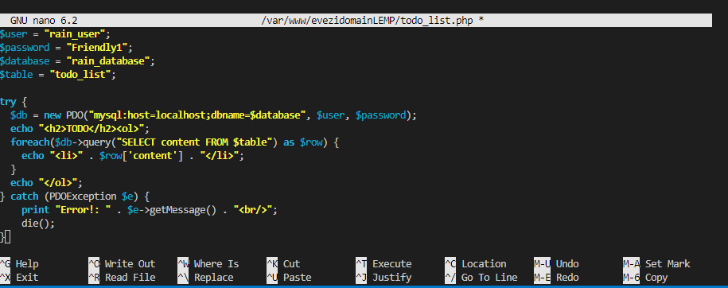;

`http://3.86.42.242/todo_list.php` --(Access this page in my web browser by visiting public IP address configured for your website out of var/www/evezidomainLEMP/todo_list.php directory,now my PHP environment is ready to connect and interact with MySQL server.)
![Msql-AccessWebpage-PublicIpAd](./Image-2/Msql-AccessWebpage-PublicIpAd-2-11.PNG;

